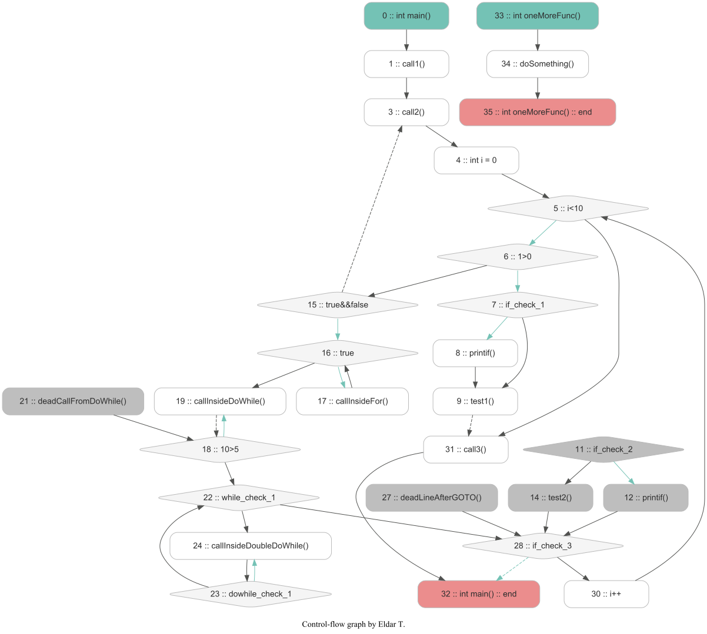

**Control flow graph for C programs using ANTLR**

I used [`antlr\grammars-v4`](https://github.com/antlr/grammars-v4/blob/master/c/C.g4) project for build AST. \
Please note that I have not used this code in its purest form.

For build ANTLR parser I used [IntelliJ IDEA plugin](https://plugins.jetbrains.com/plugin/7358-antlr-v4-grammar-plugin). \
Just do right click on `java/ru/er_log/antlr/C.g4` source page and then click `Generate ANTLR recognizer`.

<p align="center">
    
</p>

This graph shows the result for this `C` code:

```C
int main()
{
    call1();
    call2();
    call3();

    if (true) { call1(); }
    do { call2(); } while (true);

    for(;;) {
        if (true) {
            if (true) printif();
            test2();

            if (true) printif();
            else test2();
        }
        // Comment block
        else if (true) {
            for(;;) { doo(); }
            do { doo(); } while(true); /* This is comment. */
            while(true) { do { doo(); } while(true); }
        }
        else printif3();

        if (true) { return; }
    }
    
    call5();
    call6();
}

int onemorefunc() {
    dodo();
}
```